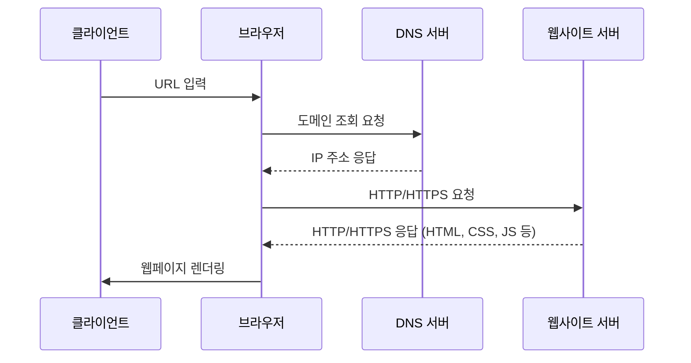

# HTTP

## HTTP 기초

- 브라우저는 인터넷에서 웹 애플리케이션의 서버를 특정하기 위해 URL과 DNS 방식을 사용함
- DNS와 HTTP는 TCP/IP 프로토콜을 사용하여 통신함

### URL
인터넷에서 리소스가 위치하는 장소를 나타내는 문자열을 **URL(Uniform Resource Locator)** 이라고 한다.
```text
https://www.example.com:443/path/to/index.html
```
- 스키마명(프로토콜): 통신 프로토콜 (HTTP, HTTPS 등)
- 호스트명(도메인): 서버의 위치 표시 (example.com)
- 포트번호: 서버의 포트 번호, HTTP의 기본 포트 번호는 80 (443)
- 경로: 서버의 리소스 위치 (path/to/index.html)

### DNS
DNS(Domain Name System)는 도메인 이름을 IP 주소로 변환하는 시스템이다.
- 192.0.2.0/24 → example.com
- 호스트(www)와 도메인(example.com)으로 구성된 FQDN(fully qualified domain name)를 기준으로 함

### TCP/IP
TCP/IP(Transmission Control Protocol/Internet Protocol)는 인터넷에서 데이터를 전송하기 위한 프로토콜이다.

| 레이어        | 역할                                       | 대표 프로토콜               |
|------------|------------------------------------------|-----------------------|
| 응용계층       | 애플리케이션에서 통신                              | HTTP,SMTP             |
| 전송계층       | 인터넷 계층에서 받은 데이터를 응용계층으로 전달<br/>데이터 오류 감지 | TCP,UDP               |
| 인터넷계층      | 어떤 컴퓨터로 데이터를 전달할지 결정                     | IP                    |
| 네트워크 접속 계층 | 전기 신호 전송 및 전송을 제어하며 오류 감지                | Ethernet, IEEE 802.11 |


### HTTP 메시지
HTTP의 경우 브라우저와 서버 사이 HTTP 메시지라는 정해진 형식에 따라 데이터를 주고 받는다. (HTTP/1.1 기준으로 설명)
1. HTTP 요청
    ```text
    POST / HTTP/1.1
    Host: localhost:3000
    Connection: keep-alive
    ...
    Cache-Control: max-age=0
    
    id=1&message=hello // body
    ```
2. HTTP 응답
    ```text
    HTTP/1.1 200 OK
    content-encoding: gzip
    content-type: text/html; charset=utf-8
    ...
    content-length: 648
    
    <!doctype html>
   <html>
   ...
    ```

### HTTP 메서드
| 메서드     | 설명                        |
|---------|---------------------------|
| GET     | 서버에 리소스를 요청하는 메서드         |
| HEAD    | 서버에 리소스의 메타데이터를 요청하는 메서드  |
| POST    | 서버에 데이터를 전송하는 메서드         |
| PUT     | 서버에 리소스를 생성하거나 업데이트하는 메서드 |
| DELETE  | 서버에 리소스를 삭제하는 메서드         |
| CONNECT | 서버와 클라이언트 간의 터널을 생성하는 메서드 |
| PATCH   | 서버에 리소스를 부분적으로 업데이트하는 메서드 |
| OPTIONS | 서버에 지원하는 메서드를 요청하는 메서드    |
| TRACE   | 서버에 요청을 회귀하는 메서드          |
- GET, HEAD, OPTIONS, TRACE는 리소스를 변경하는 부작용이 없어 안전한 메서드로 간주
- POST, PUT, DELETE, PATCH는 리소스를 변경하여 부작용의 가능성이 있는 메서드
- CONNECT는 프록시 서버가 통신 데이터를 볼 수 없을 때 데이터를 그대로 전달할 때 사용
- TRACE는 XST를 통한 정보 유출 위험 → 거의 모든 브라우저가 지원 X

### HTTP 상태 코드
- 1XX: 현재 처리중인 정보 전달
- 2XX: 정상 처리된 정보 전달
- 3XX: 리다이렉트 관련 정보 전달
- 4XX: 클라이언트 오류 관련 정보 전달
- 5XX: 서버 오류 관련 정보 전달

### HTTP 헤더
- Request 헤더
  - Host: 서버의 호스트명과 포트 번호를 지정
  - User-Agent: 클라이언트의 정보 (브라우저, OS 등)
  - Referer: 요청을 보낸 페이지의 URL

- Response 헤더
  - Server: 서버의 정보 (서버 종류, 버전 등)
  - Location: 리다이렉트할 URL

- 엔티티 헤더
  - Content-Length: 리소스의 크기 (바이트 단위)
  - Content-Type: 리소스의 미디어 타입

### 쿠키를 이용한 상태 관리
- 클라이언트와 서버 간 상태를 유지하기 위해 서버와 통신한 정보를 브라우저 안에 저장하는 쿠키라는 방식이 생겨남
- 쿠키는 key-value 형태로 저장하며 브라우저를 닫아도 유지됨
```text
SESSION_ID : 1234567890
```
- 서버에서 쿠키를 브라우저에 저장하기 위해 Set-Cookie 헤더를 사용
```text
Set-Cookie: SESSION_ID=1234567890
```

## 안전한 통신을 위한 HTTPS

### HTTP의 약점
1. 통신 데이터 도청이 가능함
2. 통신 상대의 진위 여부를 확인하기 어려움 (ex. 위장 서버)
3. 통신 과정에서 데이터 수정 여부가 확인이 안됨

### TLS
- HTTPS(HTTP over TLS)를 사용해 HTTP의 약점 보완 가능
- HTTP 요청을 보내기 전 TLS 헨드셰이크

#### 1) 통신 데이터 암호화
- TLS는 평문 데이터를 암호화하여 전송하고 상대는 암호문을 복호화하여 데이터의 내용 확인
- 암호화에 사용되는 시크릿 키는 서버와 클라이언트 간에만 안전하게 공유됨

#### 2) 통신 상대 검증
- TLS는 전자 인증서로 통신 상대 확인 (전자 인증서는 CA가 발급)
- CA에서 발행되지 않은 인증서가 사용되면 브라우저는 경고를 표시

#### 3) 통신 데이터 변경 체크
- 인증 태그라는 검증용 데이터를 사용하여 암호문의 변조 여부 확인
- 변조 확인은 HTTP 통신 뿐만 아니라 TLS 핸드셰이크 중에도 진행

### 안전한 컨텍스트만 이용가능한 API
- Secure Context: 인증과 보안의 일정 기준을 만족하는 Window와 Worker 등의 컨텍스트를 가리킴
  - https:// 또는 wss:// 사용
  - http://localhost, http://127.0.0.1, file://의 URL로 시작하는 로컬 호스트 통신

### Mixed Content의 위험성
- Mixed Content: HTTPS 페이지에서 HTTP 리소스를 불러오는 것
- 브라우저는 HTTP 리소스의 파일 변경 여부를 감지할 수 없어 보안적 이슈 발생 가능

1. Passive Mixed Content
   - 이미지, 영상, 오디오 등의 리소스가 Mixed Content를 발생시키는 패턴
   - 브라우저 상에 실행되는 코드는 포함하지 않으므로 영향이 비교적 적음

2. Active Mixed Content
   - 자바스크립트와 CSS 등 브라우저에서 실행되는 코드가 포함된 리소스
   - 브라우저에서 실행되는 코드가 포함되어 있어 보안적 이슈 발생 가능
   - 대부분의 브라우저에선 다른 사이트로 전송되는 Active Mixed Content를 차단함

### HSTS를 사용해 HTTPS 강제하기
- HSTS(HTTP Strict Transport Security): HTTPS 통신을 강제하는 정책
- 응답 헤더에 `Strict-Transport-Security`를 설정하여 HSTS를 사용
```text
Strict-Transport-Security: max-age=31536000; includeSubDomains
```
- HSTS Preload 사용 시 처음 접속부터 HTTPS로 통신 가능
- HSTS Preload는 HSTS Preload List에 등록하여 사용
