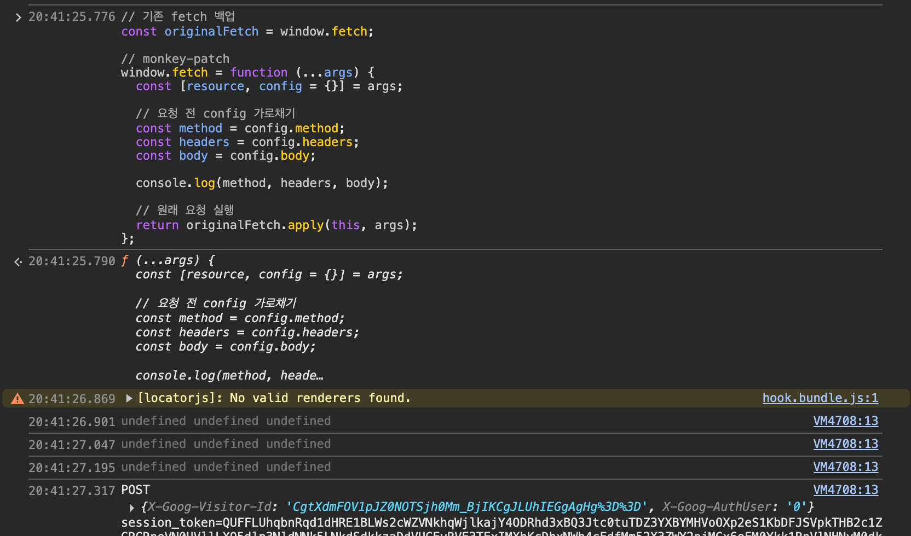

# 1. XSS

### 1-1. 정의

- XSS는 Cross Site Scripting의 약자로, 외부 스크립트를 실행할 때 발생 가능한 취약점을 의미한다.
- 통계적으로 보고된 취약점 중 가장 개수가 많다고 한다.

### 1-2. 수동적 공격 방식에 속함

- 웹 공격의 2종류인 능동적 공격, 수동적 공격 중 수동적 공격에 속한다.
    - 능동적 공격: 공격자가 직접 공격을 실행
        - (ex) SQL Injection, OS Command Injection
    - 수동적 공격: 공격자의 유도를 받아 사용자가 접근해서 실행
        - (ex) CSRF, XSS, Open Redirection, 클릭재킹

# 2. XSS로 악용 가능한 작업

- 전역 객체로 접근 가능한 선에서 모든 일이 가능하다.
- JavaScript 실행을 통해 …
    - 사용자의 보안 정보를 탈취(공격자 서버로 전송)
    - 기존 form의 기능을 변경하거나 가짜 form을 생성해 피싱
    - 직접 임의의 요청을 실행
- in-memory로 accessToken을 보관하는 경우 추적이 어려울 것으로 보았지만, fetch를 monkey-patch 한다면 여전히 config에 대한 interceptor를 작성할 수 있다. (아래는 예시이다)
    
    ```jsx
    // 기존 fetch 백업
    const originalFetch = window.fetch;
    
    // monkey-patch
    window.fetch = function (...args) {
      const [resource, config = {}] = args;
    
      // 요청 전 config 가로채기
      const method = config.method;
      const headers = config.headers;
      const body = config.body;
      
      console.log(method, headers, body);
    
      // 원래 요청 실행
      return originalFetch.apply(this, args);
    };
    ```
    
- YouTube에서 세션 토큰가 찍힘을 확인할 수 있다.
    
    
    

# 3. XSS 공격의 종류 3가지

- XSS에는 Reflected, Stored, DOM-based가 있고, 각각 반사형, 저장형, DOM 기반형이라고 한다.
- 반사형(비지속형)
    - 희생자: 공격자가 배포한 URL로 접속한 사용자
    - 방법: URL에 실행할 HTML/JS을 포함시켜 사용자가 해당 URL을 통해 접속 시 해당 코드를 실행
- 저장형(지속형)
    - 희생자: 공격자가 업로드한 스크립트를 실행하는 사용자 (게시판 상세 페이지 등)
    - 방법: 게시판 등 User Content Upload가 가능한 곳에 스크립트를 업로드하고 실행
- DOM 기반형
    - 희생자:
    - 방법:

# 4. 방어 방법

### 4-1. HTML/JS Sanitization

- DOMPurify 라이브러리를 활용하면 안전한 escape이 가능하다.
    - (ex) `<, >` —> `lt, gt`
- https://github.com/cure53/DOMPurify

```jsx
import DOMPurify from 'dompurify';

const clean = DOMPurify.sanitize('<b>hello there</b>');
```

### 4-2. httpOnly Cookie

- JavaScript로 아예 접근할 수 없게 만든다.

### 4-3. javascript URI Scheme 제한

- href 같은 속성에서는 Javascript URI Scheme도 사용할 수 있다.
    - `<a href="javascript:alert('hello')" />`
    - href 속성에 삽입 전 URI Scheme을 확인하여 필터링할 수 있다.

# 5. 번외: URL Encoding

- URL에는 모든 문자열이 들어갈 수 있지만, URL 자체는 ASCII만 표현 가능하다.
- 따라서 ASCII 이외의 문자열은 UTF-8 인코딩 상의 각 바이트를 16진수로 변환해 문자열로 인코딩하는데, 이를 퍼센트 인코딩이라고 한다.
    - (ex) **`"한"` → `%ED%95%9C`**
